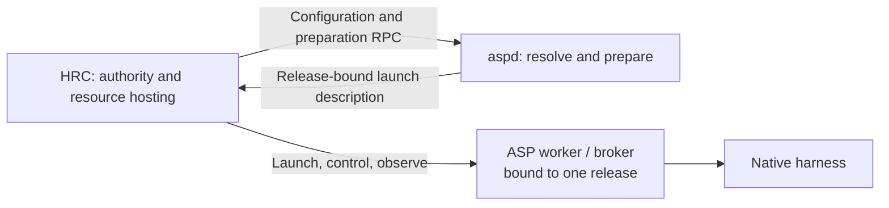

# Independent ASP Execution and the HRC Process Boundary

Status: exploratory proposal; not ratified architecture.

## Objective

An ASP execution fix must reach newly started work without changing HRC's
lockfile, rebuilding or reinstalling HRC, or restarting its daemon.

The ASP/HRC process boundary is a deliberate release boundary. ASP owns an
independently installed execution implementation. HRC consumes stable process
protocols for configuration, preparation, execution control, and evidence.
HRC's runtime release contains no ASP configuration, compiler, materialization,
driver, or harness execution implementation.

The decisive proof holds one built HRC artifact and its running process fixed,
activates a changed ASP release, and observes that change in newly prepared
execution while existing workers remain usable.

Internal HRC package extraction follows this boundary. Creating
`hrc-authority` and `hrc-runtime-host` is useful only after their interfaces
preserve the independent deployment demonstrated above.

## Why the current boundary does not deliver independence

The coupling extends beyond direct execution-library imports.

| Current mechanism | Coupling it preserves | Required destination |
| --- | --- | --- |
| ASP implementation packages pinned in HRC's lockfile and immutable release | ASP fixes require an HRC dependency advance and deployment | Independently installed ASP execution release |
| HRC profile parsing and runtime-intent assembly | Configuration semantics depend on the HRC build | ASP configuration/preparation RPC |
| HRC constructs direct harness plans and selects named broker drivers | New execution behavior can require HRC edits even without implementation imports | ASP execution selection; HRC checks generic hosting requirements and capabilities |
| ASP binaries selected from HRC's bundled dependencies, with per-binary overrides | Compiler and worker selection can disagree; an external executable still coexists with pinned in-process behavior | One ASP-owned release selection for each execution attempt |
| ASP install links checkout executables and advances/rebuilds HRC by default | ASP has no independent immutable activation boundary | ASP release installation and activation with no HRC mutation |
| HRC interprets native hooks, OTEL events, and provider transcripts | Provider-format fixes remain HRC releases | ASP normalization and provider-specific recovery |
| Shared protocol packages move with the entire ASP implementation publication set | Interface dependencies cause lockfile churn even when the wire contract is unchanged | Separately versioned protocol/client publications |

Representative source evidence:

- [HRC ASP dependency sync set](scripts/sync-asp-from-verdaccio.ts).
- [Runtime-intent assembly](packages/hrc-core/src/runtime-intent-assembly.ts).
- [Direct harness planning](packages/hrc-server/src/agent-spaces-adapter/direct-agent-harness.ts)
  and [driver admission](packages/hrc-server/src/agent-spaces-adapter/compile-profile-selector.ts).
- [ASP executable selection](packages/hrc-server/src/asp-toolchain.ts).
- [ASP install and downstream sync](../agent-spaces/justfile).
- [Native event interpretation](packages/hrc-events/src/otel-normalizer.ts)
  and [transcript interpretation](packages/hrc-server/src/hrc-event-helper.ts).

## Process topology

Each logical node has an independently supervised ASP preparation service,
called `aspd` here, and durable ASP execution workers. Their lifetimes differ.

`aspd` serves local configuration and preparation requests through a stable,
node-scoped endpoint. It owns profile interpretation, composition,
materialization, execution selection, and selection of an ASP release for new
preparations. Existing ASPC implementation and protocols are starting points;
the current cohosted facade is not the required service topology.

ASP workers own live harness execution, per-seat admission, execution receipts,
and normalized evidence. HRC communicates with these workers directly. Worker
processes and their endpoints survive replacement of `aspd`; stopping `aspd`
must not stop workers or remove HRC's control connection.

HRC supplies generic hosting for resources it owns: process launch, sockets,
tmux leases, rediscovery, and execution of authorized lifecycle actions. ASP
supplies a release-specific launch description. HRC does not choose between
ASP binary names or construct driver-specific command lines.

Participant-served workers remain valid. Registration and attachment do not
imply that HRC launched the worker or owns its native host. Hosting a bridge
also conveys no authority over the native host's lifetime.

The service is per logical node, including separately hosted nodes on one
machine. HRC federation continues to choose and establish the home node; ASP
does not acquire a second placement registry or cross-node routing protocol.

## Responsibility and authority

| Owner | Responsibilities |
| --- | --- |
| HRC authority | Addresses, reservations, home-node establishment through existing federation mechanisms, sessions, generations, attempt identity, continuation selection, attachment, succession, activation, caller authorization, and cross-seat scheduling |
| HRC resource hosting | HRC-owned process and terminal resources, launch intent and receipts, identity observation, rediscovery, and execution of authorized stop/cleanup operations |
| ASP preparation | Configuration interpretation, harness/model/driver selection, materialization, execution preparation, hosting requirements, and release-specific bootstrap descriptions |
| ASP worker | Harness behavior, per-seat admission mechanism, native input application, start/submission receipts, normalized events, and native continuation/resume observations |
| HRC application layer | Drives durable operations across these interfaces, coordinates database transactions, schedules recovery, serves APIs, and publishes HRC projections |

ASP interprets profile declarations; HRC applies placement and ownership law.
An ASP response cannot allocate an HRC address, advance a generation, select an
HRC successor, or override a continuation-clear barrier.

HRC chooses the authorized submission operation and applies caller policy. The
broker determines admission and produces application evidence. Acceptance,
landing, and turn completion remain distinct facts. HRC persists and acts on
broker receipts without becoming their author.

Ghostty actuation remains with `hrc-viewer`. Collaboration records and
obligations remain with wrkq. This proposal does not change either boundary.

## The preparation contract

The central result is a prepared execution bound to one immutable ASP release.
Its shared envelope carries:

- The HRC attempt and correlation identities supplied by the caller.
- The selected ASP release identity and required process protocol.
- Required hosting resources and execution capabilities.
- A release-specific bootstrap launch description.
- An immutable, opaque ASP execution payload.
- Diagnostics and the requested continuation's preparation result.

The launch description names executables and dependencies from the selected
immutable release. It must not resolve through a moving `current` path or
HRC's dependency tree when the attempt is later launched or retried.

HRC validates the shared envelope, supported hosting requirements, its own
identity and authority fields, and existing environment ownership rules. ASP
validates execution-specific payload contents. HRC must not reproduce ASP's
compiler, provider mappings, private schemas, or driver-selection rules in its
validators. Existing identity and integrity checks must be explicitly mapped
to the new envelope and producer validation before their old forms are removed.

The immutable ASP payload is persisted with the HRC attempt, or through a
durable reference whose recovery contract is equally explicit. A preparation
handle that exists only in `aspd` memory is insufficient. The initial design
should use persisted payload bytes to avoid introducing a second attempt store.

Preparation can resolve and materialize resources; it cannot start a native
invocation or apply its initial input. Lightweight direct-harness preparation
remains lightweight inside ASP. Moving it across a process boundary does not
require sending every harness through the full ASPC compiler.

## Establishment and recovery ordering

Preserve the current participant path's durable boundaries:

1. **Establish authority and identity.** HRC performs the applicable address,
   session, and attempt decisions. Direct registration may precede preparation.
2. **Freeze preparation and hosting intent.** HRC commits the ASP result and
   selected release, then the intended resources and HRC lifecycle policy,
   before launch effects.
3. **Realize resources.** HRC allocates or verifies its resources and may launch
   the worker's bootstrap process. It persists actual or verified rediscovered
   leases. Bootstrap must not execute the native invocation before the next
   boundary.
4. **Freeze complete dispatch.** HRC commits the unchanged ASP payload together
   with actual resource bindings, dispatch environment, identity fences, and
   its lifecycle policy before requesting invocation establishment.
5. **Ensure, attach, activate.** The ASP worker returns its durable start
   receipt. HRC validates correlated evidence, confirms attachment, and commits
   activation under the existing lifecycle rules.

External effects occur between database transactions. Reconciliation resumes
the same operation from durable records. Startup, foreground requests, and
periodic recovery use the same decisions and effect interfaces.

Once preparation is committed against release A, retries continue against A
even after B is activated. Frozen dispatch cannot be rebuilt from newer
configuration or silently executed by B. Missing release A is an explicit
recovery problem. Before preparation has committed and before any execution
effect, a retry may prepare against the newly active release.

Known unapplied, applied, and uncertain outcomes remain distinct. A lost reply
does not authorize another native start or input application. Broker receipt
and replay semantics remain the source of execution evidence.

Do not replace existing state graphs with a universal lifecycle chain. Address
reservation, attempt progress, attachment epoch, host ownership, process
liveness, endpoint reachability, presentation availability, and prior recovery
have different lifetimes. An unreachable socket is not proof of host death;
an absent presentation resource is not a failed invocation. Existing
`runtime.status` can remain a compatibility projection during migration.

## Independent ASP releases and activation

ASP builds an immutable release containing its execution dependency closure.
Installation makes that artifact available. Activation selects it for new
preparation work and activates the corresponding service code. Neither action
updates HRC's lockfile, rebuilds HRC, republishes HRC, or restarts HRC.

Activation has an observable boundary: requests accepted after it use the new
preparation release. Previously accepted requests may finish on the old release;
their responses identify that release. Persistent control connections must be
retired or redirected as part of activation so HRC cannot keep unknowingly
using an old resident compiler. A brief preparation outage is acceptable;
existing workers remain controllable throughout it.

Keep these facts distinct in status:

| Fact | Meaning |
| --- | --- |
| Installed ASP release | Artifact selected for service activation |
| Active preparation release | Code answering new preparation requests |
| Attempt execution release | Code committed for a pending or live execution attempt |
| HRC release and supported protocols | Controller code and its compatibility range |

Each worker reports its actual release at handshake. HRC compares it with the
attempt's committed selection. A package version or launcher path alone is not
proof of which code is executing.

Existing workers retain their executable release. Rollback changes the default
for new preparations; it does not downgrade live workers, rewrite frozen
attempts, or make a new receipt/journal format readable by an older binary.
Retain releases referenced by pending attempts, live workers, or unresolved
recovery. Automated release deletion requires a reliable reference inventory.

The execution-code pin does not silently freeze mutable agent source files or
change established prompt/resource reload behavior. Preserve those semantics
and distinguish configuration inputs from executable release identity.

HRC and ASP acquire independent fleet deployment targets and readbacks. An HRC
deployment must not move the active ASP release as a side effect. An ASP
deployment must not advance HRC or ACP producer tuples. Different supported ASP
worker releases can coexist on a node without constituting deployment failure.

## Protocol and dependency discipline

HRC's installed dependency closure may contain a small, explicitly allowed
protocol/client layer: wire types, validation, framing, and transport. It may
not contain ASP configuration, compilation, materialization, harness adapters,
or execution implementations, including through transitive dependencies.

Protocol/client packages have versions independent of the ASP execution
publication stream. An implementation-only ASP release does not require
republishing those contracts or advancing an HRC pin. Stable identity and CLI
utility libraries can remain dependencies under their own release discipline;
removing every cross-repository library is not the objective.

Compatibility is based on supported wire versions and capabilities. New driver
implementations and model/configuration behavior that fit existing contracts
work with unchanged HRC. New hosting primitives or lifecycle semantics can
legitimately require a coordinated protocol change.

Specify extension behavior: additive diagnostic metadata must not force a
consumer rebuild; unknown lifecycle semantics must not be interpreted as idle,
terminal, safe to retry, or successfully applied. Unsupported requirements
produce a named refusal before native execution.

Preparation-service compatibility and worker compatibility are separate
handshakes. HRC must stop requiring a cohosted broker merely to compile or
inspect an agent. Existing ASPC and broker operations should be reused where
their semantics fit; no existing method name or package layout is itself an
architectural requirement.

## Events, continuation, and offline recovery

ASP interprets provider-native hooks, OTEL payloads, transcript formats, and
continuation artifacts. HRC consumes normalized execution evidence and owns
its event log, run outcomes, monitor state, response projection, and indexing.

`hrc-events` and `hrc-capture-verifier` therefore require responsibility review:
provider parsing moves behind ASP; HRC projection and evidence comparison stay
where their authority belongs. Shared render types must come from pure
contracts rather than an execution implementation package.

A dead worker cannot serve RPC. The recovery contract must include a stable,
documented broker journal readable without the worker, or an ASP-owned offline
reader from the relevant release. HRC must not compensate by parsing private
provider files. Replay identity, ordering, retention, and historical attribution
must preserve current recovery guarantees.

HRC selects continuation and enforces clear/reuse barriers. ASP reports whether
the selected continuation can be used and what resume was requested or observed.
An incompatible continuation cannot silently become a fresh start. A successor
may use a newer ASP release only through that explicit preparation contract.

## Failure isolation

| Condition | Required behavior |
| --- | --- |
| `aspd` unavailable | Existing worker control and evidence paths continue. Preparation-dependent work waits or fails explicitly. |
| HRC restarts while `aspd` is unavailable | Existing worker reattachment uses committed identity, endpoint, and release records; it does not require fresh preparation. |
| Participant registration needs no ASP preparation | It retains the existing registration path and authority gates. |
| Configuration RPC unavailable | HRC reports unavailable declaration evidence; it does not manufacture an absent profile or placement rule. |
| Worker endpoint lost | HRC records the observation and applies existing recovery/succession law; it does not infer host death or ownership release. |
| Frozen attempt's ASP release missing | The attempt remains recoverable and visibly blocked; no substitution with the active release. |
| Protocol or required capability incompatible | Refuse before native execution with the incompatible requirement identified. |
| Native start or input outcome uncertain | Preserve identity and uncertainty; no speculative restart, resend, or synthetic success. |

HRC must contain no fallback compiler, bundled execution fallback, or local
plan reconstruction for ASP service outages.

## Migration sequence and gates

### 1. Ratify the boundary and map every current path

Inventory production imports, transitive release dependencies, executable
selection, driver-specific decisions, profile resolution, previews, federation
capability checks, continuation inspection, and offline recovery. Assign each
operation an authority owner, effect owner, durable record, and retry rule.

Define the process contracts and identify amendments to existing invariants
before implementation. This proposal does not silently supersede their laws.

**Gate:** every execution path has a destination, including direct harnesses,
interactive and headless workers, participant-served joins, and diagnostic
recovery. No path is left to an implicit bundled fallback.

### 2. Deliver immutable ASP releases and independent activation

Provide node-scoped service discovery, immutable release installation,
activation, release readback, and retention of referenced releases. Separate
protocol publication from execution publication. Remove downstream deployment
side effects when the consumer cutover makes them obsolete.

ASP release work and HRC adapter development can proceed in parallel after the
contract is fixed. The installed proof waits for both.

**Gate:** ASP can activate and roll back independently; a committed preparation
still names a usable immutable release across either action.

### 3. Prove one complete execution path with frozen HRC

Move one named production path through preparation, generic hosting, worker
control, recovery, and disposal. Preserve its existing transaction boundaries.
Freeze the resulting HRC artifact and test it against ASP releases A and B.

**Gate:** the deployment matrix below passes for that path. This is pilot
acceptance, not acceptance of the full migration.

### 4. Move all remaining execution knowledge across the boundary

Migrate configuration/client resolution, remaining harness routes, participant
preparation, event normalization, continuation inspection, and recovery.
Independent groups can run in parallel against the agreed contracts.

**Gate:** every supported production path passes its real process round trip;
driver/model changes within the contract require no HRC source change.

### 5. Remove the old dependency and deployment mechanisms

Delete obsolete implementation imports, executable resolvers, HRC-hosted plan
builders, bundled packages, and the ASP-to-HRC execution sync path. Update
release manifests, status, fleet tooling, build instructions, and CI to express
independent releases. Preserve unrelated producer management.

**Gate:** inspect the actual installed HRC artifact and dependency closure,
not only source imports. Full deployment independence passes across all
supported paths. HRC build/install requires no ASP execution artifact.

### 6. Extract HRC internals along the proven interfaces

Authority decisions can move to `hrc-authority`; generic hosting mechanisms can
move to `hrc-runtime-host`. Keep the ASP protocol adapter separate from process
ownership. Modules receive narrow interfaces, never the whole server object.

Keep one HRC SQLite database initially. Partition writes by ownership and
recovery obligations. Launch intents are durable obligations, and committed
execution events may be recovery evidence; neither is automatically disposable
because it lives outside the authority module.

Ordinary SDK/CLI commands become HRC clients without ASP profile interpretation.
Local daemon administration and offline diagnostics retain their necessary
local dependencies. Preserve current state semantics during extraction; a new
universal state machine is outside this migration.

**Gate:** enforce module dependencies and write ownership without changing
the independently verified behavior. This phase is not prerequisite to the
independent ASP deployment milestone.

## Acceptance: installed artifacts across releases and failures

Run these checks against built, installed artifacts with isolated real state
and real supported harnesses. Workspace source links and mocks do not establish
release compatibility. Record HRC artifact identity, ASP releases, actual
worker identities, and behavioral evidence.

| Exercise | Required observation |
| --- | --- |
| Keep HRC H running with ASP A; activate B containing a visible execution change | New preparation and execution demonstrate B's behavior; HRC artifact, lockfile, and process are unchanged. |
| Keep an A worker active during ASP activation | It continues accepting supported input and producing correlated evidence. |
| Resume an A preparation after B activation | It uses A and establishes at most one native invocation for the attempt. |
| Lose the start reply or restart at an establishment boundary | Recovery preserves frozen dispatch and receipt identity; uncertain outcome never authorizes duplicate execution. |
| Restart the same HRC release with A and B workers present | Both reattach with correct identities and event continuity. |
| Roll the preparation default back from B to A | New preparations use A; existing B workers remain correctly controlled. |
| Stop `aspd`, then exercise existing workers and HRC recovery | Existing control and reattachment work; preparation-dependent requests report unavailability. |
| Present an incompatible protocol or unsupported hosting requirement | Refusal precedes native execution and names the incompatibility. |
| Exercise both hosted and participant-served ownership | Resource realization, stop, and recovery respect actual ownership; no native host authority is inferred from bridge hosting. |
| Reconnect or recover a terminated worker's retained evidence | Replay preserves ordering and historical identity without restoring stale control authority or parsing provider-private formats in HRC. |
| Build and install HRC without ASP implementation packages available | It contains only the allowed contract/client dependencies and needs no execution package to build or install. |

ASP CI must test against a frozen supported HRC artifact, including a previous
supported consumer where compatibility is promised. HRC CI must prove it can
control the supported worker versions that can coexist after activation and
rollback. A green suite against current ASP workspace source is a different
claim and cannot substitute for either gate.

## Existing laws the implementation must preserve or explicitly amend

- [ASP toolchain selection](architecture/records/invariants/hrc-runtime.asp-toolchain-selection.yaml):
  replace bundled selection and per-binary release ambiguity explicitly.
- [Participant lifecycle](architecture/records/invariants/hrc-runtime.participant-session-lifecycle.yaml):
  preserve registration independence, commit ordering, ownership, attachment,
  succession, continuation, and recovery distinctions.
- [Broker admission](architecture/records/invariants/hrc-runtime.harness-broker-admission-client.yaml):
  preserve HRC caller policy and broker-owned admission/evidence.
- [Continuation history](architecture/records/invariants/hrc-runtime.continuation-history-resume.yaml):
  preserve clear barriers and distinguish carried history from native resume.
- [Viewer boundary](architecture/records/invariants/hrc-runtime.viewer-presentation-sidecar.yaml):
  preserve presentation failure isolation and Ghostty actuation ownership.

The first milestone is independent ASP delivery demonstrated against frozen
HRC. The final migration removes every production path that can secretly run
ASP execution behavior from HRC's release.
